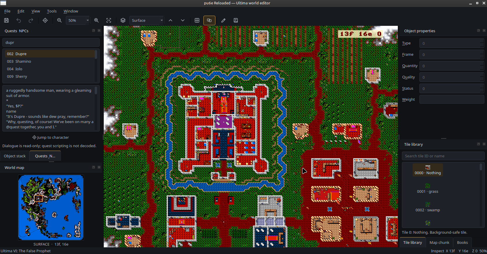

# pu6e Reloaded

A Python 3.14 port of Jim Ursetto's **pu6e 0.6.0**, a world editor for
*Ultima VI*, *Martian Dreams*, and *Savage Empire*. The original source was
published at [3e8.org](https://3e8.org/hacks/ultima6/) in 2003.

The historical source and documentation are retained in this repository. The
active desktop runtime uses Python 3.14, native PySide6/Qt 6, NumPy, and
current PyOpenGL. The obsolete SWIG LZW extension has been replaced with a
memory-safe pure-Python decoder. The old sources are kept for historical
reference and are not part of the active package build.



## Requirements

- Python 3.14
- [uv](https://docs.astral.sh/uv/) on the host machine
- A desktop OpenGL implementation that supports a compatibility-profile context
- The original game data for one of the supported games

PySide6 provides official prebuilt Qt 6 wheels. Installing pu6e does not
require compiling the desktop toolkit from source.

## Install

Create the environment and install the locked project dependencies from the
repository root:

```console
uv venv --python 3.14
uv sync
```

Start the native game launcher:

```console
.venv/bin/pu6e
```

Use the cog beside Ultima VI, Martian Dreams, or The Savage Empire to choose
that game's working directory. The launcher checks the original game files and
saved-world data before revealing its **Launch editor** button, and remembers
each game independently in `pu6e.conf`. Existing single-game configurations
are detected automatically. Game assets are copyrighted and are not included.

On Ubuntu systems using Qt's X11 platform plugin, install the required cursor
library if it is absent:

```console
sudo apt install libxcb-cursor0
```

The current checked-out `.venv` may already run through a localized workaround;
installing the system library is the reliable setup for a fresh environment.

For game-data preparation, configuration examples, navigation, editing,
keyboard shortcuts, safe saving, and troubleshooting, see the
**[User Guide](docs/USAGE.md)**.

## Development

Sync the development environment with host `uv`, then run the test suite from
the virtual environment:

```console
uv sync
.venv/bin/pytest
```

## License

The original pu6e sources are distributed under the license in
[`00LICENSE.txt`](00LICENSE.txt) and the GNU GPL text in [`00GPL.txt`](00GPL.txt).
