# pu6e Reloaded manual

A complete, illustrated guide to installing pu6e Reloaded, configuring an
unconfigured launcher, opening *Ultima VI: The False Prophet*, navigating
Britannia, inspecting and editing its world, and saving your work safely.

The initial setup walkthrough deliberately concentrates on **Ultima VI**.
*Martian Dreams* and *The Savage Empire* use the same launcher and separate
configuration profiles, but their installations are not needed to follow this
manual.

## Contents

1. [Before you begin](#1-before-you-begin)
2. [Install pu6e Reloaded](#2-install-pu6e-reloaded)
3. [Prepare an Ultima VI working copy](#3-prepare-an-ultima-vi-working-copy)
4. [Start with an unconfigured launcher](#4-start-with-an-unconfigured-launcher)
5. [Configure Ultima VI](#5-configure-ultima-vi)
6. [Open the world editor](#6-open-the-world-editor)
7. [Understand the workbench](#7-understand-the-workbench)
8. [Navigate Britannia](#8-navigate-britannia)
9. [Zoom and change world levels](#9-zoom-and-change-world-levels)
10. [Inspect locations and objects](#10-inspect-locations-and-objects)
11. [Move, copy, create, and delete objects](#11-move-copy-create-and-delete-objects)
12. [Browse tiles and edit terrain](#12-browse-tiles-and-edit-terrain)
13. [Inspect and replace map chunks](#13-inspect-and-replace-map-chunks)
14. [Browse quests, NPCs, and books](#14-browse-quests-npcs-and-books)
15. [Save changes and test them in the game](#15-save-changes-and-test-them-in-the-game)
16. [Keyboard and mouse reference](#16-keyboard-and-mouse-reference)
17. [Configuration files and additional games](#17-configuration-files-and-additional-games)
18. [Troubleshooting](#18-troubleshooting)
19. [Historical and technical references](#19-historical-and-technical-references)

## 1. Before you begin

pu6e Reloaded is a **native desktop world editor**, not the Ultima VI game
itself, an emulator, a browser application, or a replacement for a game
installation. It reads the original game's data and existing saved world. When
you save, it writes modified data back into the game directory you configured.

You need:

- A legally obtained, complete copy of *Ultima VI: The False Prophet*.
- At least one saved game created by launching Ultima VI normally.
- Python 3.14.
- [`uv`](https://docs.astral.sh/uv/) for installing the project environment.
- A desktop session with compatibility-profile OpenGL support.
- Enough disk space for a separate, disposable copy of your game installation.

The project does **not** include copyrighted Ultima game assets. Buying or
owning the game is your responsibility; pu6e Reloaded only edits files you
already possess.

> **Important:** Never configure the editor against your only game installation
> or your only save. Make a complete working copy before continuing. Keep the
> game, Steam/GOG clients, and cloud-save synchronization closed while editing.

## 2. Install pu6e Reloaded

The following sequence starts with a clean Ubuntu 24.04-compatible desktop,
including Linux Mint 22.x. There are **two different dependency layers**:

1. Ubuntu packages provide the native graphics, X11, and Qt platform libraries.
2. Python packages provide pu6e, the Qt bindings, OpenGL bindings, and NumPy.

`uv sync` installs the second layer; it cannot install missing Ubuntu system
libraries for you.

### Install Ubuntu or Linux Mint system packages

Refresh the package index and install the basic command-line, OpenGL, and Qt
XCB runtime requirements:

```console
sudo apt update
sudo apt install \
  git curl ca-certificates \
  libgl1 libegl1 libgl1-mesa-dri \
  libxkbcommon-x11-0 \
  libxcb-cursor0 libxcb-glx0 libxcb-icccm4 libxcb-image0 \
  libxcb-keysyms1 libxcb-randr0 libxcb-render-util0 \
  libxcb-shape0 libxcb-xinerama0 libxcb-xkb1
```

These packages serve different purposes:

| Ubuntu package | Why it is needed |
| --- | --- |
| `git` | Downloads the pu6e Reloaded source repository. |
| `curl` and `ca-certificates` | Download `uv` securely over HTTPS. |
| `libgl1` and `libegl1` | Provide the desktop OpenGL and EGL runtime libraries. |
| `libgl1-mesa-dri` | Provides Mesa OpenGL drivers when applicable. |
| `libxkbcommon-x11-0` | Supplies the keyboard support used by Qt on X11. |
| `libxcb-cursor0` | Supplies the cursor library required by the Qt XCB plugin. |
| `libxcb-glx0` | Connects X11/XCB windows to OpenGL through GLX. |
| Remaining `libxcb-*` packages | Supply Qt's X11 window, image, keyboard, and rendering integrations. |

Your desktop may already include most of these packages; running the command
is safe because APT does not reinstall packages that are already up to date.
The command installs runtime libraries, not compilers or Qt development
headers.

### Install uv

If `uv` is not already installed, install it using the official standalone
installer:

```console
curl -LsSf https://astral.sh/uv/install.sh | sh
```

Close and reopen the terminal so the installer's shell-path changes take
effect, then verify the command is available:

```console
uv --version
```

If `uv` is already installed, skip the installer and continue with the version
check. Do not use the system Python package installer to manually install the
application's dependencies.

### Obtain the source code

Clone the repository and enter its directory:

```console
git clone https://gitlab.com/ShinAska/pu6e-reloaded.git
cd pu6e-reloaded
```

If you already downloaded or cloned the project, simply open a terminal in the
existing repository directory:

```console
cd /path/to/pu6e-reloaded
```

### Install Python 3.14

Install the Python version required by the project through `uv`:

```console
uv python install 3.14
```

This is a `uv`-managed Python installation. It does not replace the operating
system's Python, require a deadsnakes PPA, or modify Ubuntu's system Python.
If Python 3.14 is already available, `uv` can reuse it.

### Create the environment and install all Python packages

Create the project virtual environment and install the versions recorded in
`uv.lock`:

```console
uv venv --python 3.14
uv sync --locked
```

The commands have distinct jobs:

- `uv venv --python 3.14` creates `.venv` using the required interpreter.
- `uv sync --locked` reads `pyproject.toml` and `uv.lock`, downloads the
  declared packages, installs their transitive dependencies, and installs pu6e
  itself into that environment.

There is no separate requirements file or additional manual `pip install` step.
In fact, `uv` environments do not necessarily include `pip`; `uv` installs the
packages directly.

### Understand the installed Python packages

The application requires:

| Python package | Project requirement | Purpose |
| --- | --- | --- |
| `numpy` | `>=2.2` | Map/minimap arrays and batched OpenGL terrain rendering. |
| `PyOpenGL` | `>=3.1.9` | Python bindings for the original OpenGL world renderer. |
| `PySide6` | `>=6.11,<7` | Native Qt 6 launcher, dialogs, docks, widgets, and OpenGL integration. |
| `PySide6-Essentials` | Selected automatically by `PySide6`. | Core Qt 6 Python bindings and runtime components. |
| `PySide6-Addons` | Selected automatically by `PySide6`. | Additional Qt 6 modules required by the bundled PySide6 distribution. |
| `shiboken6` | Selected automatically by `PySide6`. | Binding runtime shared by the Qt 6 Python modules. |
| `pytest` | `>=9`, development group. | Runs the automated project test suite. |

`uv sync --locked` includes the development dependency group by default. If
you only want to run the editor and do not need `pytest`, install the runtime
packages without the development group instead:

```console
uv sync --locked --no-dev
```

PySide6, its Qt components, and NumPy are installed from prebuilt binary
wheels. You do **not** need wxPython, PyQt6, `qtbase5-dev`, a C++ compiler,
or a source build of Qt/PySide6.

### Verify the installation

Check the Python interpreter, inspect the complete resolved package tree, and
verify that installed packages agree with one another:

```console
.venv/bin/python --version
uv tree --depth 2
uv pip check
```

The Python version should begin with `Python 3.14`. The package tree should
include `numpy`, `pyopengl`, `pyside6`, the PySide6 support packages, and
`pytest` unless you selected `--no-dev`.

To check the important imports directly:

```console
.venv/bin/python -c "import numpy, OpenGL, PySide6; print('NumPy:', numpy.__version__); print('PyOpenGL:', OpenGL.__version__); print('PySide6:', PySide6.__version__)"
```

Optional: verify the desktop OpenGL implementation with Mesa's diagnostic
utility:

```console
sudo apt install mesa-utils
glxinfo -B
```

The editor needs working desktop OpenGL with compatibility-profile support;
an OpenGL ES-only environment is not sufficient.

### Launch the application

Start the installed launcher from the repository root:

```console
.venv/bin/pu6e
```

You can alternatively activate the environment first:

```console
source .venv/bin/activate
pu6e
```

The first form is less ambiguous because it always uses the correct project
environment. On Windows, the corresponding executable is
`.venv\Scripts\pu6e.exe`.

## 3. Prepare an Ultima VI working copy

### Create a save in the original game

1. Install Ultima VI using your own media or legitimately obtained release.
2. Start the original game or its bundled DOS emulator.
3. Begin or load a game.
4. Save the game.
5. Exit the game completely.

The saved game is essential: pu6e edits the current saved world's objects and
NPCs rather than reconstructing those files from an empty installation.

### Copy the entire installation

On Linux, copy the complete game directory to a separate working location:

```console
mkdir -p ~/Games
cp -a /path/to/original/ULTIMA6 ~/Games/ULTIMA6-pu6e
```

Replace `/path/to/original/ULTIMA6` with the directory that actually contains
the Ultima VI game files. On Windows, duplicate the directory in File Explorer
and give the copy a recognizable name such as `ULTIMA6-pu6e`.

Keep both copies:

- **Original installation:** untouched recovery source.
- **Working copy:** the directory selected in the pu6e launcher.

### Check the expected directory structure

The selected directory should contain the actual game files, not merely an
installer, an archive, the parent directory, or a directory containing another
game:

```text
ULTIMA6-pu6e/
├── animdata
├── animmask.vga
├── basetile
├── book.dat
├── chunks
├── look.lzd
├── map
├── maptiles.vga
├── masktype.vga
├── objtiles.vga
├── tileflag
├── tileindx.vga
├── u6pal
└── savegame/
    ├── objlist
    ├── objblkaa
    ├── objblkab
    └── ...additional saved-world object blocks...
```

The launcher validates all required resources, including 69 saved-world object
blocks. A normal installation contains additional files not shown here.

> **Case-sensitive Linux filesystems:** Historical DOS releases sometimes use
> uppercase filenames. pu6e expects the lowercase names shown above. Make any
> necessary filename changes only inside your backed-up working copy.

## 4. Start with an unconfigured launcher

From the repository root, run:

```console
.venv/bin/pu6e
```

On a genuinely fresh installation, the Atlas launcher opens with all three
worlds marked **Not configured**. Ultima VI is selected initially, its launch
button reads **Unavailable**, and the right-hand stage explains that no game
directory has been configured.

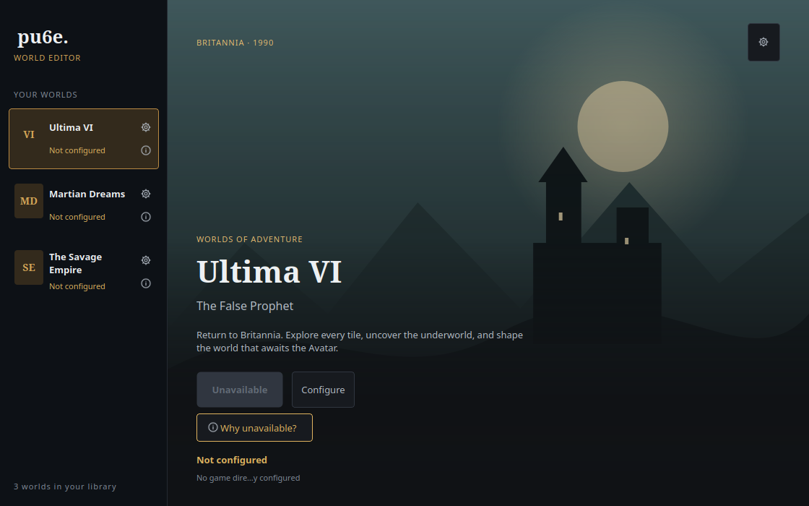

The launcher is divided into two areas:

- The **left world library** lists the available supported games, their
  current configuration state, and an individual settings cog for each world.
- The **right world stage** describes the selected game and contains its
  launch, configuration, and diagnostic controls.

Nothing is broken when **Launch editor** is unavailable on first launch. It is
intentionally disabled until the selected game directory passes validation.

### Understand the initial warning

Hover over **Why unavailable?** or the small information icon beside Ultima VI
to see the specific explanation and suggested fix:

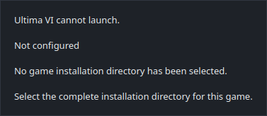

The warning means:

1. No Ultima VI installation directory has been selected.
2. The launcher cannot inspect the original game assets yet.
3. You need to choose a complete Ultima VI working copy.

Proceed to the configuration dialog; there is no need to manually create a
configuration file.

## 5. Configure Ultima VI

### Open the configurator

Make sure **Ultima VI** is selected in the left world library. Then use any of
these equivalent controls:

- Click **Configure** on the Ultima VI world stage.
- Click the small settings cog beside **Ultima VI** in the world library.
- Click the settings cog in the upper-right corner of the world stage.

The Ultima VI configuration dialog initially contains an empty directory field
and a disabled **Save configuration** button:

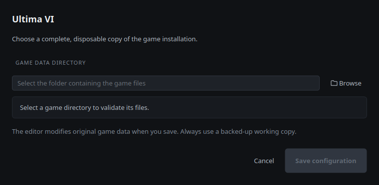

### Choose the game data directory

Click **Browse** and select your copied `ULTIMA6-pu6e` directory, or paste the
complete directory path into **GAME DATA DIRECTORY**.

Select the directory containing `map`, `chunks`, `u6pal`, and `savegame`.
Do not select:

- The directory above the installation.
- The `savegame` subdirectory by itself.
- The original archive or installer.
- A *Martian Dreams* or *The Savage Empire* installation.

Validation updates immediately as the path changes. You can correct a problem
without closing or reopening the dialog.

### If the saved game is missing

If the installation is complete but the saved-world data is missing, the
dialog identifies the missing `savegame` directory or specific saved-world
files and keeps **Save configuration** disabled:

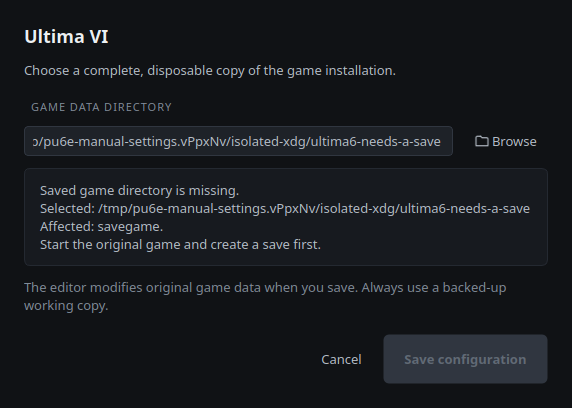

To fix it:

1. Close the configurator or leave it open.
2. Start Ultima VI normally.
3. Create a save and exit the game.
4. Copy the complete `savegame` directory into your working installation if
   your release keeps saves somewhere else.
5. Re-enter or browse to the working directory so the launcher validates it
   again.

If a launcher, DOS emulator, Proton prefix, or cloud-save system stores saves
outside the main installation, locate its active save location first. pu6e
expects the complete saved-world files inside the selected working copy's
`savegame` directory.

### If the wrong folder is selected

If you accidentally select the games directory, a parent directory, or another
incomplete folder, the configurator lists the affected files and does not
allow the invalid configuration to be saved:

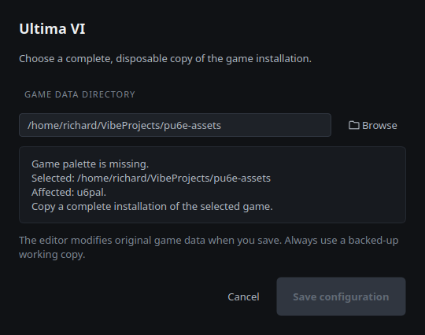

Go one level deeper and select the directory containing the actual Ultima VI
files. If the folder belongs to another supported game, the dialog identifies
the mismatch instead.

### Save the verified configuration

When every required game and saved-world file is present, the status changes
to **Installation verified. All required game files are present.** The
**Save configuration** button becomes available:

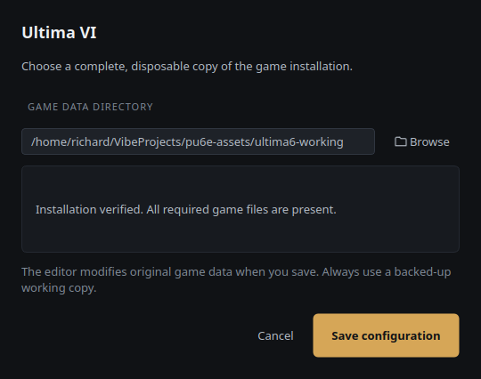

Click **Save configuration**. The launcher records the directory in your user
configuration and returns to the selected Ultima VI stage.

Ultima VI now reads **Ready** in the world library, the main status reads
**Ready to explore**, and the primary action changes to **Launch editor**:

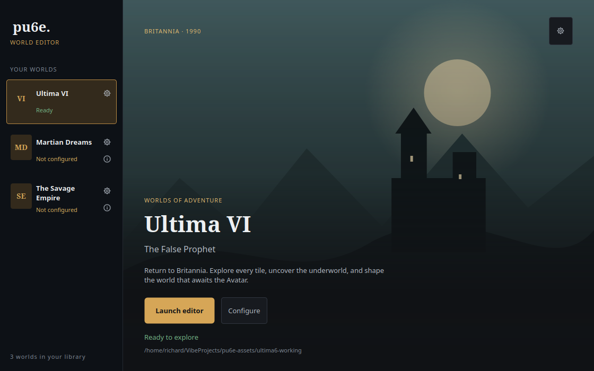

*Martian Dreams* and *The Savage Empire* can remain unconfigured indefinitely.
They do not prevent Ultima VI from launching.

## 6. Open the world editor

Click **Launch editor** while Ultima VI is selected.

The launcher loads the original game resources and current save, initializes a
compatibility-profile OpenGL map, and opens the editor near Lord British's
castle. The original world uses hexadecimal coordinates; the default starting
position is approximately `X 134`, `Y 16c`, level `0`.

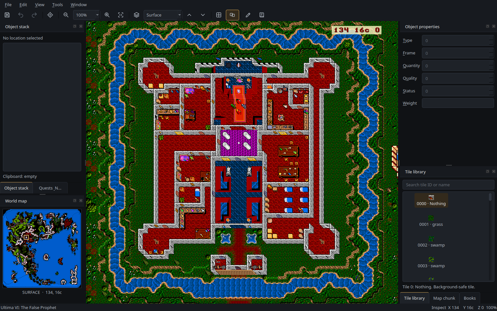

Closing the editor returns you to the launcher. The Ultima VI profile remains
configured for future launches.

If a graphics or OpenGL error appears instead of the map, see
[OpenGL or blank map](#opengl-or-blank-map) before changing any game files.

## 7. Understand the workbench

The workbench contains six main regions:

1. **Menu bar:** File, Edit, View, Tools, and Window.
2. **Icon toolbar:** save, undo/redo, coordinate jump, zoom, world level,
   overlays, terrain mode, and quest browsing.
3. **Central world map:** the live original Ultima VI tile and object view.
4. **Left docks:** Object stack, Quests & NPCs, and the World map overview.
5. **Right docks:** Object properties, Tile library, Map chunk, and Books.
6. **Bottom status bar:** current game, editing mode, hexadecimal coordinates,
   world level, and zoom percentage.

Dock panels are native Qt panels. You can resize them, drag them to another
edge, tab related panels together, hide them, or float them as independent
windows. Use **Window** to reopen a dock you previously closed.

### World map overview

The lower-left **World map** dock shows the complete current surface or
underworld level using the original game palette:

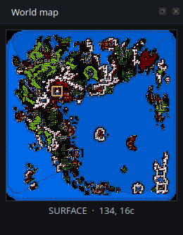

The brass rectangle marks the currently visible area. Click another point on
the overview to jump there, or drag across the overview to move continuously.
Press `M` to hide or restore this dock.

## 8. Navigate Britannia

Click the central map before using map-navigation keys so the world canvas has
keyboard focus.

### Pan using the mouse

- Hold the **middle mouse button** and drag to pan without editing game data.
- When terrain editing is disabled, left-drag **empty background terrain** to
  pan the view.
- Left-dragging an actual object moves that object instead of panning; identify
  the tile under the pointer before dragging.

### Move using the keyboard

| Input | Result |
| --- | --- |
| Arrow keys | Move the current view by one tile. |
| Numeric keypad directions | Move the current view by one 8×8 map chunk. |
| Numeric keypad diagonals | Move diagonally by one map chunk. |
| Numpad `5` | Descend one world level. |
| Numpad `0` | Ascend one world level. |

On Windows, enable Num Lock if your numeric keypad does not send the expected
direction keys.

### Jump to precise coordinates

Use **Tools → Go to coordinates…**, click the crosshair icon on the toolbar,
or press `Ctrl+G`:

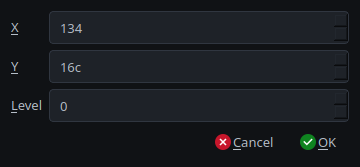

Enter:

- **X:** horizontal world coordinate in hexadecimal.
- **Y:** vertical world coordinate in hexadecimal.
- **Level:** `0` for the surface or `1` through `5` for the underworld.

For example, `X 134`, `Y 16c`, `Level 0` returns near Castle Britannia. The
lowercase letters `a` through `f` represent hexadecimal digits, not errors.

## 9. Zoom and change world levels

### Choose a zoom level

The toolbar's percentage selector offers:

- `25%` for the widest supported overview.
- `50%` for seeing more surrounding terrain.
- `100%` for the default original-pixel scale.
- `200%` for closer inspection.
- `400%` for the closest supported view.

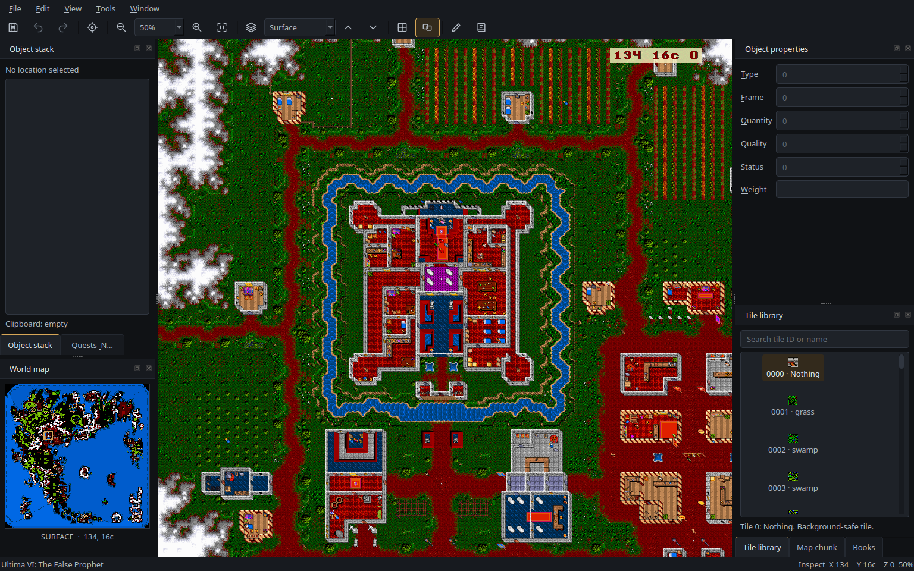

You can also use the toolbar's magnifying-glass icons, press `+` to zoom in,
press `-` to zoom out, or press `Ctrl+0` to return directly to `100%`. Both
the toolbar selector and bottom status bar display the current percentage.

Zooming is capped at **25% minimum** and **400% maximum**. Controls disable
when their corresponding limit is reached.

### Visit the surface and underworld

The toolbar selector immediately to the right of the zoom controls contains:

```text
Surface
Underworld 1
Underworld 2
Underworld 3
Underworld 4
Underworld 5
```

Choose a level to jump directly to it. The world map overview and coordinate
display update to show the new level:

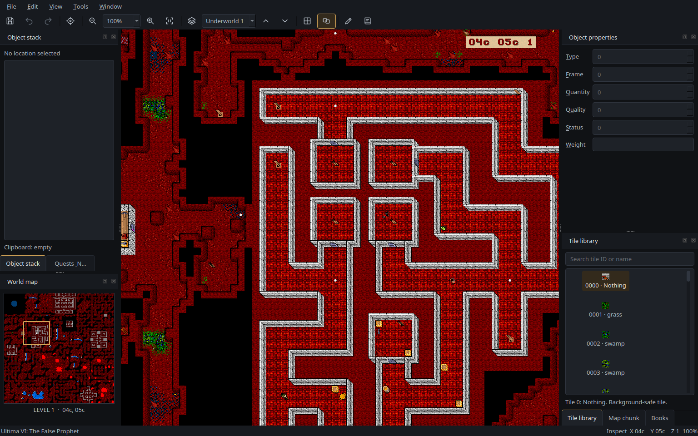

Additional level controls:

- Click the layers icon to return directly to the surface.
- Click the up/down chevrons to ascend or descend one level.
- Press `Alt+Up` to ascend or `Alt+Down` to descend.
- Use numpad `0` to ascend or numpad `5` to descend.

Surface coordinates and underworld coordinates are adjusted according to the
original game's world layout; the underworld does not share the same full
surface dimensions.

## 10. Inspect locations and objects

Left-click a map location to select it. pu6e updates the status bar, selects
the corresponding map tile, identifies its map chunk, and populates the
Object stack and Object properties panels:


### Object stack

The **Object stack** panel lists objects at the selected tile, with container
contents nested beneath their parent object:

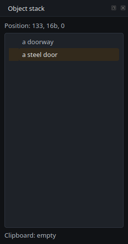

Objects are ordered from the lower parts of the stack toward the top. Expand a
container to inspect its contents. Selecting an object updates the adjacent
Object properties dock.

An empty list means no game object is present at the selected location; the
background map tile still exists and can be inspected or painted separately.

### Object properties

The **Object properties** dock exposes raw original-game object fields:

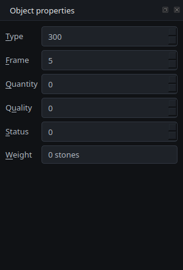

| Field | Meaning | Notes |
| --- | --- | --- |
| Type | Base Ultima VI object identifier. | Changing it can also change the valid frame range. |
| Frame | Appearance, orientation, or visual state. | The allowed range depends on the object type. |
| Quantity | Stack quantity. | Zero can represent an individual object rather than an empty stack. |
| Quality | Game-specific behavior or metadata. | May encode links, spells, books, or other semantics. |
| Status | Raw object-status byte displayed in hexadecimal. | Edit cautiously; values are game-format data. |
| Weight | Calculated total object weight. | Read-only; displayed in stones. |

These controls manipulate low-level game data. They do not validate whether a
particular combination of values makes sense to Ultima VI's gameplay scripts.
Change one field at a time, retain a backup, and verify the result in-game.

## 11. Move, copy, create, and delete objects

### Move an object on the map

1. Locate an existing object in the central world view.
2. Left-click and hold the object.
3. Drag it to the destination tile.
4. Release the mouse button.

NPCs can be moved, but moving important characters can affect gameplay and
scripts. Multi-tile objects are positioned relative to their lower-right
anchor, so their visible footprint may extend beyond the destination tile.

### Copy an object on the map

Hold `Ctrl` while left-dragging an object to create a copy at the destination.
Objects that cannot safely be cloned, including NPCs, are not duplicated.

### Edit using the Object stack

Give the Object stack tree keyboard focus, select an item, and use:

| Key | Action |
| --- | --- |
| `X` | Cut the selected object into the internal clipboard. |
| `C` | Copy a clone of the selected object into the clipboard. |
| `V` | Paste after the current object. |
| `Shift+V` | Paste before the current object. |
| `B` | Paste inside the selected container. |
| `Ctrl+V` | Paste inside the selected container. |
| `N` | Create the default object on the clipboard. |
| `Insert` | Create the default object on the clipboard. |
| `Delete` | Delete the selected object. |

The **Clipboard** label below the tree shows what is currently available to
paste. An object leaves the clipboard after it is pasted because every object
instance must occupy exactly one place in the game world. To create multiple
copies, repeat the copy-and-paste workflow.

> **Object safety:** Do not leave an Ultima VI egg container empty. The
> original game can crash when loading malformed object-generation eggs. Avoid
> deleting or cloning key NPCs, quest objects, or linked objects without a
> complete backup.

### Undo limitations

`Ctrl+Z` and `Ctrl+Y` support edits recorded in the editor's undo stack,
including terrain painting and map-chunk replacement. Not every direct object
mutation is individually reversible through Undo. Treat your copied game
directory, not the undo button, as your final recovery mechanism.

## 12. Browse tiles and edit terrain

### Find a tile

The **Tile library** on the right lists original game tiles, previews their
graphics, and allows searching by tile number or name:

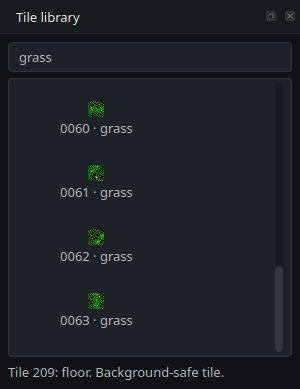

To choose a terrain tile:

1. Open **Window → Tile library** if the dock is hidden.
2. Search for a tile name or numeric identifier.
3. Select the desired tile.
4. Check the summary below the list.

Valid background tiles have IDs **0 through 255**. The library can also show
object tiles up to 2,047, but those tiles are labeled **not valid as map
background** and cannot be painted onto terrain.

### Paint with the right mouse button

1. Select a valid background tile in the Tile library.
2. Right-click the destination tile in the world map.
3. Right-drag to paint the selected tile across multiple locations.

Right-button painting works with a valid selected background tile even when the
dedicated terrain-edit mode is turned off.

### Copy existing terrain with terrain-edit mode

Enable **Tools → Edit terrain**, press `Ctrl+T`, or click the pencil icon in
the toolbar. The toolbar button becomes selected and the bottom status bar
changes from **Inspect** to **Terrain editing**:


While terrain-edit mode is enabled:

1. Find a source background tile in the central map.
2. Left-drag the background tile to a destination.
3. Release to copy that background tile.

If an object blocks access to the desired source tile, use **View → Objects**
or press `O` to temporarily hide objects. Restore object visibility afterward.

Turn terrain mode off when finished so that left-dragging empty terrain returns
to safe map panning.

## 13. Inspect and replace map chunks

Ultima VI groups its world tiles into reusable **8×8 chunks**. The Map chunk
tool shows which chunk is currently assigned to the selected location:

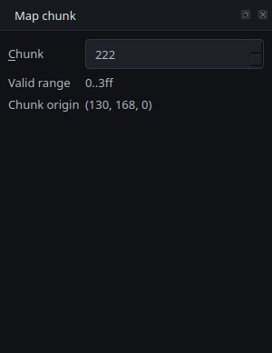

Open it from **Window → Map chunk** or select its tab beside the Tile library.
The panel shows:

- The current hexadecimal chunk identifier.
- The valid identifier range.
- The selected chunk's world-coordinate origin.

Changing the chunk identifier replaces the selected 8×8 area with a different
existing game chunk. This is an edit, not merely a viewing preference.

To copy a chunk visually instead, hold `Shift` while left-dragging from the
source chunk to the destination. Chunk replacement participates in Undo/Redo,
but you should still verify the surrounding terrain and keep a full backup.

## 14. Browse quests, NPCs, and books

### Open Quests & NPCs

Press `Ctrl+K`, choose **Tools → Quests and NPCs**, or click the quest icon on
the toolbar. The Quests & NPCs panel opens in the left dock while the central
map and world overview remain available:

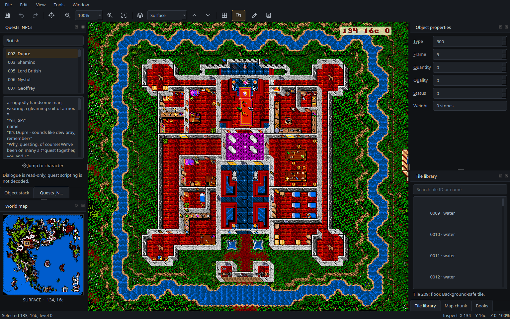

The panel contains:

1. A search field for character names, dialogue, or quest clues.
2. A list of matching conversation entries.
3. A read-only conversation preview.
4. A **Jump to character** action when the selected NPC has a valid location.

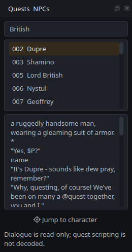

For example, searching for `British` can reveal Lord British and characters
whose conversation mentions him. Select a character to inspect their extracted
dialogue. If **Jump to character** is enabled, click it to center the map on
that character's current saved-world location.

Conversation content and quest clues are **read-only**. The original game's
quest scripting, branching dialogue, control flow, and quest flags have not
been sufficiently decoded for safe quest creation or modification. The editor
does not claim to create or rewrite quests.

### Read Ultima VI books

Choose **Window → Books** or select the **Books** tab in the right-hand dock:

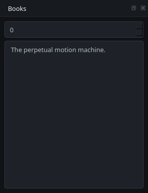

Select a book number to display its decoded text. The viewer is read-only.
The corresponding book formats in *Martian Dreams* and *The Savage Empire*
are not currently decoded and may show no available text.

## 15. Save changes and test them in the game

Choose **File → Save world**, click the disk icon on the toolbar, or press
`Ctrl+S`:

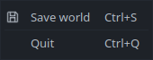

Saving can write:

- Changed saved-world object blocks.
- NPC data.
- Modified map data.
- Modified map-chunk data.

The editor creates `.bak` files beside files it rewrites. Those local backups
are useful, but they are **not** equivalent to keeping a complete untouched
copy of the original game installation and save.

### Recommended safe workflow

1. Exit Ultima VI and pause any cloud-save synchronization.
2. Make a complete, disposable copy of the game directory.
3. Open that copy in pu6e Reloaded.
4. Make one small, intentional change.
5. Save using `Ctrl+S`.
6. Close the editor.
7. Start Ultima VI using the modified working copy.
8. Load the save and verify the modified area, nearby objects, and game flow.
9. Keep the result only after the original game loads and behaves normally.
10. Repeat incrementally for larger changes.

If saving fails, the editor reports the error. Check write permissions and
available disk space; do not assume a partially written game directory remains
safe to continue using.

### Closing and returning to the launcher

Close the editor window to return to the Atlas launcher. Your configured Ultima
VI directory remains available for the next session. The launcher refreshes
game availability so missing or changed files are detected again.

## 16. Keyboard and mouse reference

### Global editor actions

| Shortcut | Action |
| --- | --- |
| `Ctrl+S` | Save the edited world. |
| `Ctrl+Z` | Undo the latest supported edit. |
| `Ctrl+Y` | Redo the latest supported undone edit. |
| `Ctrl+Q` | Close the editor. |
| `Ctrl+G` | Open the hexadecimal coordinate dialog. |
| `Ctrl+K` | Open Quests & NPCs. |
| `Ctrl+T` | Toggle terrain-edit mode. |
| `Ctrl+0` | Reset zoom to 100%. |
| `Alt+Up` | Ascend one world level. |
| `Alt+Down` | Descend one world level. |
| `+` or `=` | Zoom in. |
| `-` | Zoom out. |

### View and dock controls

| Shortcut | Action |
| --- | --- |
| `A` | Toggle animated tiles. |
| `P` | Toggle palette rotation. |
| `H` | Toggle hybrid-tile animation. |
| `O` | Toggle object visibility. |
| `G` | Toggle the map-chunk grid. |
| `L` | Toggle the center-coordinate overlay. |
| `F` | Toggle fullscreen mode. |
| `S` | Toggle the Object stack dock. |
| `T` | Toggle the Tile library dock. |
| `C` | Toggle the Map chunk dock. |
| `M` | Toggle the World map dock. |

Some single-letter shortcuts have different meanings inside the Object stack
tree. For example, `C` copies an object when the tree has focus. Click the
central map to return focus to map-level shortcuts.

### Map interactions

| Mouse action | Result |
| --- | --- |
| Left-click a map tile | Select the location, objects, tile, and map chunk. |
| Middle-button drag | Pan without changing world data. |
| Left-drag empty terrain in inspection mode | Pan the map. |
| Left-drag an object | Move the selected object. |
| `Ctrl` + left-drag an object | Copy a cloneable object. |
| Left-drag background terrain in terrain-edit mode | Copy the source terrain tile. |
| Right-click or right-drag | Paint the selected valid background tile. |
| `Shift` + left-drag | Copy an existing 8×8 map chunk. |
| Click or drag the World map overview | Jump to another world location. |

## 17. Configuration files and additional games

### Where settings are stored

pu6e stores launcher profiles in your operating system's standard user
configuration location rather than inside the repository.

On Linux, the default location is:

```text
~/.config/pu6e-reloaded/config.ini
```

If `XDG_CONFIG_HOME` is set, the corresponding location is:

```text
$XDG_CONFIG_HOME/pu6e-reloaded/config.ini
```

After configuring and launching Ultima VI, the relevant sections resemble:

```ini
[game:fp]
gamedir = /home/example/Games/ULTIMA6-pu6e

[pu6e]
gamedir = /home/example/Games/ULTIMA6-pu6e
gametype = fp
width = 1024
height = 768
zoom = 1
```

`[game:fp]` remembers the Ultima VI installation. `[pu6e]` represents the
currently activated game and legacy-compatible renderer settings. `width`,
`height`, and `zoom` configure the initial map display.

Use the launcher whenever possible; manual configuration is only necessary for
advanced troubleshooting. Existing repository-local `pu6e.conf` files are
migrated automatically when no modern user configuration already exists.

### Add the other supported games later

Each supported game has its own independent launcher profile:

| Game | Internal key | Profile section |
| --- | --- | --- |
| Ultima VI: The False Prophet | `fp` | `[game:fp]` |
| Worlds of Ultima: Martian Dreams | `md` | `[game:md]` |
| Worlds of Ultima: The Savage Empire | `se` | `[game:se]` |

To add another world, select it in the launcher, open its configurator, choose
a backed-up copy of the corresponding installation, and make sure it has an
existing save. Configuring one game never requires removing the Ultima VI
profile.

The Worlds of Ultima games do not always include the original Ultima VI
bitmap-font file. If coordinate or grid labels are missing, copy `u6.ch` from
an Ultima VI installation that you own into the other game's working copy.

## 18. Troubleshooting

### The launcher says Not configured

The selected world does not have an installation profile yet. Select Ultima VI,
click **Configure**, and choose the complete backed-up Ultima VI working
directory. Hover over **Why unavailable?** for the current explanation.

### The game directory does not exist

The previously configured directory was moved, renamed, unmounted, or deleted.
Reconnect the relevant drive or browse to the working copy's new location.

### The selected path is not a directory

You selected a file such as an installer, archive, executable, or save file.
Choose the containing Ultima VI game-data directory instead.

### A different game installation was selected

The selected directory contains another supported Ultima game. Choose the
actual Ultima VI directory for the Ultima VI profile, or select the matching
world in the launcher before configuring its files.

### Required game files or the game palette are missing

The directory is incomplete, points to the wrong folder, or contains a release
whose data was not fully extracted. Check that files such as `map`, `chunks`,
`basetile`, `tileflag`, `tileindx.vga`, `book.dat`, and `u6pal` exist in the
selected directory. Copy a complete installation again if necessary.

### The saved game directory or saved-world files are missing

Run Ultima VI normally, create a save, exit, and ensure the working copy
contains:

```text
savegame/objlist
savegame/objblk*
```

The saved-world blocks form a complete set; copying only `objlist` does not
make the game ready. If your release stores active saves in another directory,
copy the entire save into the working copy's `savegame` folder.

### A game filename has incorrect capitalization

On case-sensitive filesystems, `MAP` and `map` are different filenames. pu6e
reports the expected and discovered names. Rename files only in your backed-up
working copy, or use a filesystem that preserves the required names.

### Game files cannot be read

Check that your account has read access to the game files and read/search
access to their directories. If you intend to save changes, also make sure the
working copy is writable. Network drives and read-only mounts can introduce
additional restrictions.

### Save configuration remains disabled

Read the validation panel inside the configurator. The button becomes enabled
only when the selected directory belongs to the correct game and all required
game files and saved-world files are available.

### OpenGL or blank map

The world renderer needs a desktop OpenGL **compatibility-profile** context.
An OpenGL ES-only context or desktop OpenGL core-only context does not provide
the fixed-function APIs used by the original renderer.

Check the graphics driver, desktop session, and OpenGL implementation. Remote
sessions, containers, software-rendering setups, and some Wayland-only
configurations may require an X11/GLX-capable desktop session or a compatible
software OpenGL driver.

### Qt cannot load the xcb platform plugin

On Ubuntu, install the missing cursor dependency and restart the launcher:

```console
sudo apt install libxcb-cursor0
```

If another Qt/X11 library is missing, install the corresponding distribution
package rather than attempting to rebuild PySide6 from source.

### Coordinates or grid labels are missing

Confirm that the game directory includes the required Ultima VI bitmap-font
file. The other Worlds of Ultima installations can reuse `u6.ch` from a
legitimately owned Ultima VI copy.

### The quest browser is empty

Ultima VI conversation browsing requires compatible conversation archives in
the selected game directory. Clear the search field first. Games without
supported conversation data show an explicit unavailable message.

### Undo is disabled

No undoable terrain or map-chunk operation is available in the current edit
history. Direct object operations are not all represented in the undo stack;
restore your backed-up working copy if an irreversible object change needs to
be discarded.

### Changes do not appear in the game

Confirm you saved successfully, exited the editor, and launched the game using
the same working installation and save that pu6e edited. A launcher, emulator,
or cloud-save system may be reading a different save directory.

## 19. Historical and technical references

The modern manual describes the maintained Python 3 / Qt 6 application.
Historical documents are preserved for attribution and research, but their
Python 2, wxWindows, and repository-local setup instructions do not describe
the current supported workflow.

- [Documentation index](README.md).
- [Original pu6e 0.6.0 manual](history/README-0.6.0.txt).
- [Original pu6e installation instructions](history/INSTALL-0.6.0.txt).
- [Original copyright and license notice](history/NOTICE-0.6.0.txt).
- [Ultima VI development notes](reference/u6notes.txt).
- [Ultima VI file-format technical reference](reference/u6tech.txt).
- [Object-generation egg mechanics](reference/eggs.txt).
- [Practical egg-editing guide](reference/eggs2.txt).

For project history, supported games, licensing, credits, and development
information, return to the [project README](../README.md).
